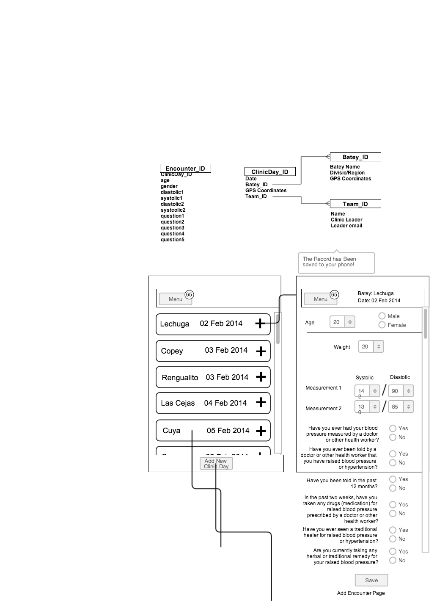

- [ ] a task list item
- [ ] list syntax required
- [ ] normal **formatting**, @mentions, #1234 refs
- [ ] incomplete
- [x] completed

#HBS Grupos Data Collection App

##Summary

An offline app built for the collection of *anonymous* patient data from bateys of La Romana, Dominican Republic

##Plan

A fully-cached and internet-independent webapp capable of displaying various pages of forms, saving form data locally (on the device), and uploading collected data to a mysql server once a 3G or WiFi connection is established.

##Technologies to be employed:
- [TaffyDB](taffydb.com)
- off canvas menus (css, js)
- javascript on the client for all of the data manipulation and HTTP POST messages
- python on the server to recieved HTTP POST requests and insert them into a mySQL database
- Harvest? for database visualization?

##Wireframes

First pass:

###Potential Workflow:
1. user opens app
	- prompt:
		- disclaimer:
			- data is not encrypted
	- pop-up: save to home screen!
	- Two choices:
		- add new encounter
		- view saved encounters (badge=unsumbitted encounters)
1. add new encounter
	- to: team selection screen
		- select a team
			- get list of teams from server 
			- get list of unsaved teams from taffyDB (badge:"!"- onClick:alert("this team had not been saved to the server")
		- add a new team option
			- adds a new team record to taffyDB (needs to be synced)
1. select a team
	- to: select a clinic day
		- list of saved clinic days
		- add a new clinic day
1. select a clinic day
	- to: encounter form	
	
##HTN Questions

Taken from the WHO Stepwise Tool

- Interviewer ID
- Device ID for blood pressure
- Cuff size used
- Reading 1
- Reading 2
- Reading 3
- During the past two weeks, have you been treated for raised blood pressure with drugs (medication) prescribed by a doctor or other health worker?

---

- Have you ever had your blood pressure measured by a doctor or other health worker?
	- if no, stop
- Have you ever been told by a doctor or other health worker that you have raised blood pressure or hypertension?
	- if no, stop
- Have you been told in the past 12 months?
- In the past two weeks, have you taken any drugs (medication) for raised blood pressure prescribed by a doctor or other health worker?
- Have you ever seen a traditional healer for raised blood pressure or hypertension?
- Are you currently taking any herbal or traditional remedy for your raised blood pressure?

