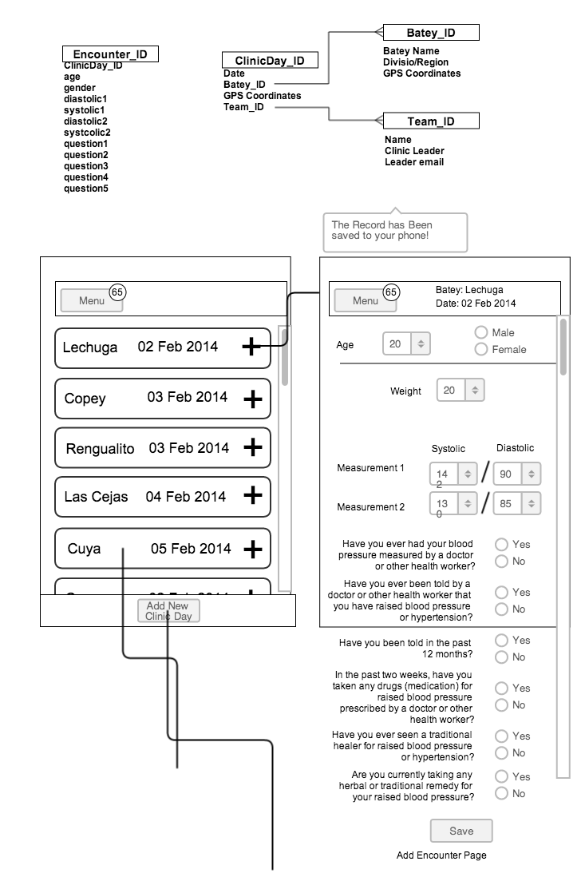

# HBS Grupos Data Collection App

## Summary

An offline, fully-cached, platform agnostic, html5-based web app built for the collection of patient data local and remote areas (namely the bateys of La Romana, Dominican Republic).

## How will if work:

This will be a web app, built using javascipt, and saved locally via a application cache [manifest](https://developer.mozilla.org/en-US/docs/Web/HTML/Using_the_application_cache).

It will work right-away on iOS and Andoud devices (phones and tablets), and should be able to work on windows phone, firefoxOS, and other smart phone OSes in the future.

Forms, pages, and data will all be stored on the device via a device-specific form of local storage (either localstorage, indexeddb, websql, etc.).

Data will be uploaded to a server and removed from the device whenever internet access is established.

Only registered users will be able to download and save the app onto their phone, and upload data, and all data on the device will be fully encrypted, and only accessible via a user password. 

### Security Details:

When a user logs into the website (on the server) their password will be hashed (hash #1) and checked against the stored hash (per usual).

If this checks out a secure, but different password hash (hash #2) will created and saved on the device. This second hash will be used to check the password regularly on the device (maybe every hour?). The users password will simultaneously be hashed a third time (hash #3) which will be used as the passcode for encryption and deleted every hour. 

##Technologies to be employed:

- javascript on the client for all of the data manipulation and HTTP POST messages
	- I'm testing frameworks, right now, but given the requirement of having a very small size, I think vanilla JS might be the best option

- python via Flask (WSGI) on the server to recieve HTTP POST requests and insert them into a mySQL database
	- flask will allow greater flexibility and portability for the app
	
- mongoDB for data persistence on the server

## Wireframes

First pass:

### Potential Workflow:
1. user opens app
	- prompt:
		- disclaimer:
			- data is not encrypted
	- pop-up: save to home screen!
	- Two choices:
		- add new encounter
		- view saved encounters (badge=unsumbitted encounters)
1. add new encounter
	- to: team selection screen
		- select a team
			- get list of teams from server 
			- get list of unsaved teams from taffyDB (badge:"!"- onClick:alert("this team had not been saved to the server")
		- add a new team option
			- adds a new team record to taffyDB (needs to be synced)
1. select a team
	- to: select a clinic day
		- list of saved clinic days
		- add a new clinic day
1. select a clinic day
	- to: encounter form	
	
## HTN Questions

Taken from the WHO Stepwise Tool

- Interviewer ID
- Device ID for blood pressure
- Cuff size used
- Reading 1
- Reading 2
- Reading 3
- During the past two weeks, have you been treated for raised blood pressure with drugs (medication) prescribed by a doctor or other health worker?

---

- Have you ever had your blood pressure measured by a doctor or other health worker?
	- if no, stop
- Have you ever been told by a doctor or other health worker that you have raised blood pressure or hypertension?
	- if no, stop
- Have you been told in the past 12 months?
- In the past two weeks, have you taken any drugs (medication) for raised blood pressure prescribed by a doctor or other health worker?
- Have you ever seen a traditional healer for raised blood pressure or hypertension?
- Are you currently taking any herbal or traditional remedy for your raised blood pressure?

